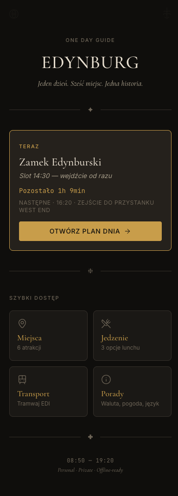
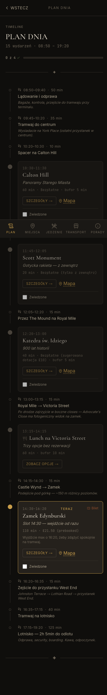
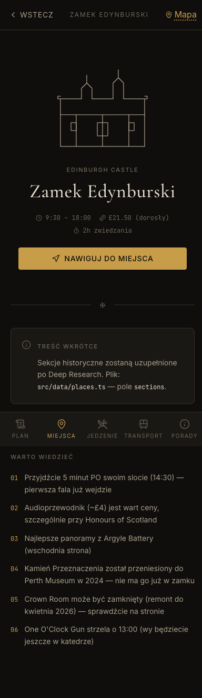

# Edinburgh Atlas

> A hand-crafted PWA companion for a one-day trip to Edinburgh — timeline, places guide, restaurants, transport and tips. Offline-first, mobile-first, three palette themes, zero backend.

**Live demo:** [edynburg.dryla.pl](https://edynburg.dryla.pl)

<table>
  <tr>
    <td align="center"><br><sub>Home — current event + quick access</sub></td>
    <td align="center"><br><sub>Plan — 15-event timeline with progress</sub></td>
    <td align="center"><br><sub>Place detail — history, tips, map link</sub></td>
  </tr>
</table>

---

## Why this exists

I built this for a real one-day family trip to Edinburgh — flight in at 08:50, flight out at 19:20, Edinburgh Castle slot at 14:30, four people, one phone in front of the group at any given time. Existing apps were either bloated travel suites with logins and analytics, or static guides without a sense of "where are we right now in the day". I wanted something that:

- Boots in under a second on mobile data, then works fully offline once cached.
- Tells me **right now** what we should be doing, and what's next.
- Lets me tap once to open Google Maps with walking directions.
- Doesn't ask me to create an account, doesn't show ads, doesn't track me.

It's a single-purpose tool, written for a specific date with specific data — but the architecture is reusable for any one-day-trip companion app.

## Features

- **Live timeline** — `/plan` shows a 15-event schedule (08:50 → 19:20) with a "now / next" indicator that updates from the device clock. Tap to mark events as done — saved in `localStorage`.
- **Places guide** — six Old Town attractions with opening hours, prices, walking duration, history sections and curated tips. Each place links straight into Google Maps with `place_id` for an exact pin.
- **Restaurants** — three hand-picked options (one recommended) with addresses, price ranges and Maps links.
- **Transport** — tram from Edinburgh Airport to the city centre and back, with ticket-buying options and a £2.40 cash-warning.
- **Tips** — currency, plugs, tipping etiquette, weather, basic Scottish vocabulary.
- **Three palette themes** — *Świeca* (medieval candle, default), *Atlas* (cartographic navy + gold), *Krew* (Highland blood-red). Switch in the top-left corner. Each palette has dark + light modes.
- **PWA install** — add to home screen on iOS/Android, full-screen standalone mode, offline-first via service worker.
- **Zero backend** — no API calls (except tapping into Google Maps), no auth, no database, no analytics, no third-party JS. Pure static SSG.

## Tech stack

- **Next.js 14** (App Router, all routes static via SSG)
- **TypeScript** (strict)
- **Tailwind CSS** (custom theme on top of CSS variables)
- **`@ducanh2912/next-pwa`** (actively maintained fork of the original `next-pwa`)
- **Lucide React** (icons)
- **`next/font/google`** for Cormorant Garamond + Inter + JetBrains Mono

No state management library. No component kit (no shadcn, no Radix, no MUI). No animation framework. Everything hand-rolled with Tailwind + CSS variables.

## Setup

```bash
git clone https://github.com/MDRYLA/edynburg-pwa.git
cd edynburg-pwa            # repo name on GitHub (npm package name: edinburgh-atlas)
npm install                # or pnpm install
npm run dev                # http://localhost:3000
```

Other commands:

```bash
npm run build    # production build (needed to test the service worker)
npm run start    # serve production build
npm run lint     # next lint
```

The PWA service worker is **disabled in dev** — you only see offline behaviour after `npm run build && npm run start`.

Node version: see `.nvmrc` (Node 20 LTS). Minimum: Node 18.17 (Next 14 requirement).

## Project structure

```
src/
├── app/                # Next.js App Router pages (6 routes + layout)
│   ├── page.tsx        # / — hero + current event + quick access
│   ├── plan/           # /plan — timeline (client component for live time)
│   ├── places/         # /places, /places/[slug] (6 SSG paths)
│   ├── food/           # /food — restaurants
│   ├── transport/      # /transport — tram info
│   └── tips/           # /tips — currency, plugs, etc.
├── components/         # ~20 React components (UI / layout / timeline / places / food)
├── data/               # Hard-coded TS data — schedule, places, restaurants, transport, tips
├── lib/                # Helpers — maps URL builders, time math, localStorage wrappers
├── styles/             # Three palette CSS files (tokens-{swieca,atlas,krew}.css)
└── types/              # Shared TS types
```

See [`docs/ARCHITECTURE.md`](docs/ARCHITECTURE.md) for a deeper dive (data flow, palette system, PWA implementation, helpers).

## Usage

The app is single-purpose — open the live demo, install as a PWA on your phone, and you can use it offline for the rest of the day. Switch themes in the top-left corner, dark/light in the top-right.

See [`docs/USAGE.md`](docs/USAGE.md) for a step-by-step walkthrough (PWA install on iOS/Android, palette switching, offline mode, plan navigation).

## License

[MIT](LICENSE) © 2026 Kacper Dryla

## Author

[Kacper Dryla](https://kacper.dryla.pl) — solo web agency in Tarnów, Poland. Next.js / Astro / Supabase / WordPress.

GitHub: [@MDRYLA](https://github.com/MDRYLA)

---

## 🇵🇱 Po polsku

**Edinburgh Atlas** to PWA-towarzysz na jednodniową wycieczkę do Edynburga, który zbudowałem dla rodzinnej wyprawy w kwietniu 2026. Apka działa offline po pierwszym załadowaniu, optymalizowana pod telefon, bez konta, bez analytics, bez backendu — czysta statyczna strona z trzema paletami kolorów (Świeca / Atlas / Krew) i trybem jasnym/ciemnym.

Stack: Next.js 14, TypeScript, Tailwind, `@ducanh2912/next-pwa`, lucide-react. Wszystkie dane (15-eventowy timeline, 6 atrakcji, 3 restauracje, transport, tipy) trzymane w plikach TypeScript w `src/data/` — żadnego CMS-a, żadnej bazy.

Live demo: [edynburg.dryla.pl](https://edynburg.dryla.pl)
